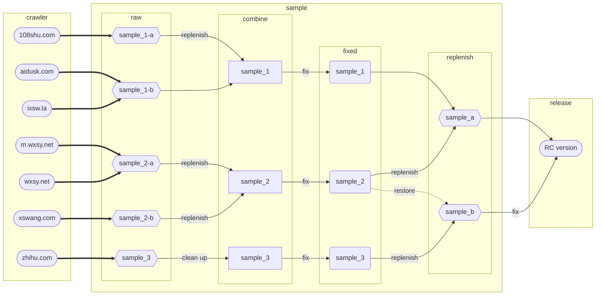

# 《栩栩若生》电子书

### [>>> 在线阅读 <<<](https://cdn.dnomd343.top/xxrs/online/)（[备用地址](https://xxrs.343.re/)）

### [>>> TXT下载 <<<](https://res.343.re/Share/XXRS/%E6%A0%A9%E6%A0%A9%E8%8B%A5%E7%94%9F.txt)（[备用地址](https://cdn.dnomd343.top/xxrs/%E6%A0%A9%E6%A0%A9%E8%8B%A5%E7%94%9F.txt)）

### [>>> MOBI下载 <<<](https://res.343.re/Share/XXRS/%E6%A0%A9%E6%A0%A9%E8%8B%A5%E7%94%9F.mobi)（[备用地址](https://cdn.dnomd343.top/xxrs/%E6%A0%A9%E6%A0%A9%E8%8B%A5%E7%94%9F.mobi)）

## 编者序

初读《栩栩若生》时，我曾给自己许诺过，若是结局皆大欢喜，就将这本小说整理发布出来，于是就有了这个项目。

小说在各个网文平台上参差不齐，章节内容均有缺失错误。项目从七个不同网站上爬取数据，相互对照，修复合并，得到了初始样本；修复逻辑可以参照自述文件的流程图，具体细节可以查阅 Commit 树记录。

再而，借助于代码进行自然语言检查，对原文中大量的防屏蔽词，例如警察、政审、刀枪之类的词语，还有错误的标点符号、繁体字、词法语法以及错别字等进行修正，前前后后共有千余处。

整合后的内容也由代码格式化发布，基于 GitBook 实现在线阅读，同时提供了多种格式的电子书，以适配各类电子阅读器。此外，资源文件中也提供了原始的 JSON 数据，可供下游项目二次发布。

最后，Just enjoy it！

## 整合流程

展开

 

### 数据来源

+ [`108shu.com`](./src/crawler/108shu.com) ：[http://www.108shu.com/book/54247/](http://www.108shu.com/book/54247/)

+ [`aidusk.com`](./src/crawler/aidusk.com) ：[http://www.aidusk.com/t/134659/](http://www.aidusk.com/t/134659/)

+ [`ixsw.la`](./src/crawler/ixsw.la) ：[https://www.ixsw.la/ks82668/](https://www.ixsw.la/ks82668/)

+ [`m.wxsy.net`](./src/crawler/m.wxsy.net) ：[https://m.wxsy.net/novel/57104/](https://m.wxsy.net/novel/57104/)

+ [`wxsy.net`](./src/crawler/wxsy.net) ：[https://www.wxsy.net/novel/57104/](https://www.wxsy.net/novel/57104/)

+ [`xswang.com`](./src/crawler/xswang.com) ：[https://www.xswang.com/book/56718/](https://www.xswang.com/book/56718/)

+ [`zhihu.com`](./src/crawler/zhihu.com) ：[https://www.zhihu.com/column/c_1553471910075449344](https://www.zhihu.com/column/c_1553471910075449344)

### 样本处理

+ 爬虫获得五份 [`raw`](./sample/raw/) 样本：

  + `sample_1-a`
  + `sample_1-b`
  + `sample_2-a`
  + `sample_2-b`
  + `sample_3`

+ 简单合并后获得三份 [`combine`](./sample/combine/) 样本：

  + `sample_1`
  + `sample_2`
  + `sample_3`

+ 对照修复错误，获得三组 [`fixed`](./sample/fixed/) 样本。

+ 合并样本，获得两组 [`replenish`](./sample/replenish/) 样本：

  + `sample_a`
  + `sample_b`

+ 修复合并，得到 [`RC`](./release/) 样本。

### 内容发布

+ `RC-1` ：初始合并版本

+ `RC-2` ：修复部分屏蔽词与语法错误

+ `RC-3` ：修复繁体中文错误

+ `RC-4` ：修复标点符号错误

+ `RC-5` ：错误修复及发布样式增强

## 许可证

MIT ©2022 [@dnomd343](https://github.com/dnomd343)
