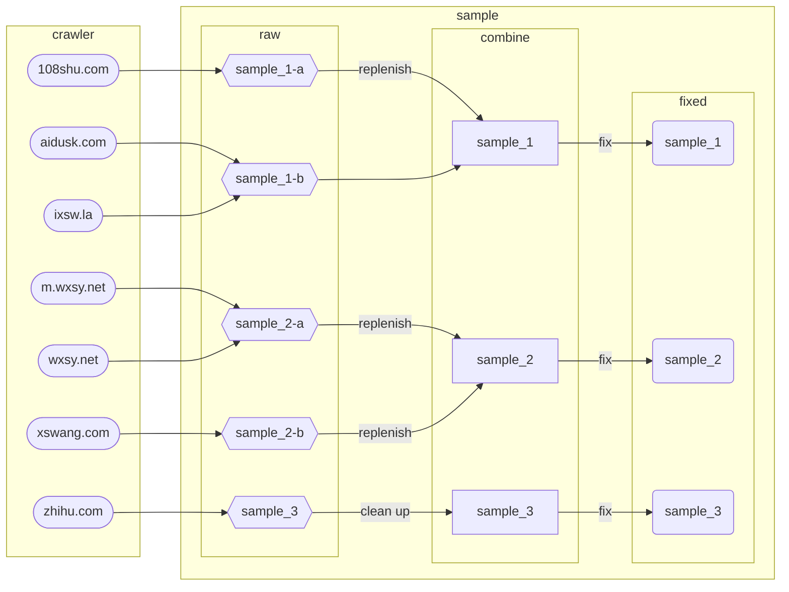

# 栩栩若生

## 数据爬虫来源

+ [`108shu.com`](./src/crawler/108shu.com) ：[`http://www.108shu.com/book/54247/`](http://www.108shu.com/book/54247/)

+ [`aidusk.com`](./src/crawler/aidusk.com) ：[`http://www.aidusk.com/t/134659/`](http://www.aidusk.com/t/134659/)

+ [`ixsw.la`](./src/crawler/ixsw.la) ：[`https://www.ixsw.la/ks82668/`](https://www.ixsw.la/ks82668/)

+ [`m.wxsy.net`](./src/crawler/m.wxsy.net) ：[`https://m.wxsy.net/novel/57104/`](https://m.wxsy.net/novel/57104/)

+ [`wxsy.net`](./src/crawler/wxsy.net) ：[`https://www.wxsy.net/novel/57104/`](https://www.wxsy.net/novel/57104/)

+ [`xswang.com`](./src/crawler/xswang.com) ：[`https://www.xswang.com/book/56718/`](https://www.xswang.com/book/56718/)

+ [`zhihu.com`](./src/crawler/zhihu.com) ：[`https://www.zhihu.com/column/c_1553471910075449344`](https://www.zhihu.com/column/c_1553471910075449344)
