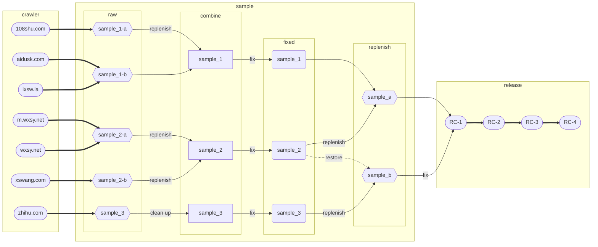

# 栩栩若生

## [>>> 在线阅读 <<<](https://xxrs.343.re/)

## [>>> TXT下载 <<<](https://res.343.re/Share/XXRS/%E6%A0%A9%E6%A0%A9%E8%8B%A5%E7%94%9F.txt)

## [>>> MOBI下载 <<<](https://res.343.re/Share/XXRS/%E6%A0%A9%E6%A0%A9%E8%8B%A5%E7%94%9F.mobi)

## 整合流程

### 数据来源

+ [`108shu.com`](./src/crawler/108shu.com) ：[http://www.108shu.com/book/54247/](http://www.108shu.com/book/54247/)

+ [`aidusk.com`](./src/crawler/aidusk.com) ：[http://www.aidusk.com/t/134659/](http://www.aidusk.com/t/134659/)

+ [`ixsw.la`](./src/crawler/ixsw.la) ：[https://www.ixsw.la/ks82668/](https://www.ixsw.la/ks82668/)

+ [`m.wxsy.net`](./src/crawler/m.wxsy.net) ：[https://m.wxsy.net/novel/57104/](https://m.wxsy.net/novel/57104/)

+ [`wxsy.net`](./src/crawler/wxsy.net) ：[https://www.wxsy.net/novel/57104/](https://www.wxsy.net/novel/57104/)

+ [`xswang.com`](./src/crawler/xswang.com) ：[https://www.xswang.com/book/56718/](https://www.xswang.com/book/56718/)

+ [`zhihu.com`](./src/crawler/zhihu.com) ：[https://www.zhihu.com/column/c_1553471910075449344](https://www.zhihu.com/column/c_1553471910075449344)

### 样本分析

1. 爬虫七个网站的数据，获得五份三组不同的 `raw` 样本：

+ `sample_1-a`
+ `sample_1-b`
+ `sample_2-a`
+ `sample_2-b`
+ `sample_3`

2. 经过简单合并后可得到三份初始 `combine` 样本：

+ `sample_1`
+ `sample_2`
+ `sample_3`

3. 进行对照合并，修复各类语法词汇错误、违禁屏蔽词等，得到三组 `fixed` 样本。

4. 再次合并，获得两份 `release` 样本：

+ `sample_a`
+ `sample_b`

5. 修复合并，得到 `RC` 样本。

### 内容发布

+ `RC-1` ：初始合并版本

+ `RC-2` ：修复部分屏蔽词与语法错误

+ `RC-3` ：修复繁体中文错误

+ `RC-4` ：修复标点符号错误

## 许可证

MIT ©2022 [@dnomd343](https://github.com/dnomd343)
