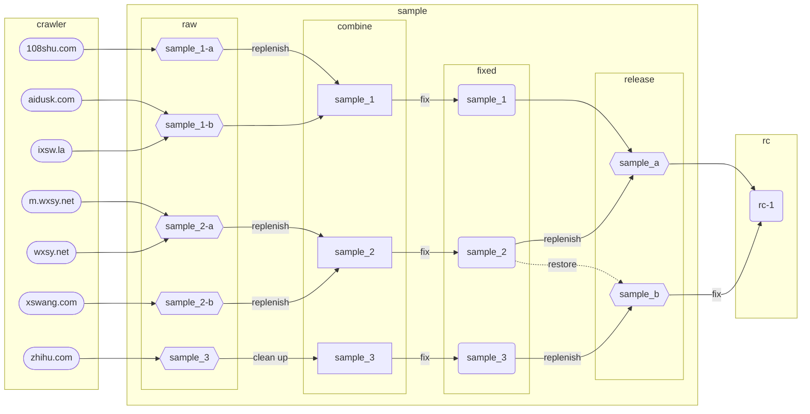

# 栩栩若生

## 数据爬虫来源

+ [`108shu.com`](./src/crawler/108shu.com) ：[http://www.108shu.com/book/54247/](http://www.108shu.com/book/54247/)

+ [`aidusk.com`](./src/crawler/aidusk.com) ：[http://www.aidusk.com/t/134659/](http://www.aidusk.com/t/134659/)

+ [`ixsw.la`](./src/crawler/ixsw.la) ：[https://www.ixsw.la/ks82668/](https://www.ixsw.la/ks82668/)

+ [`m.wxsy.net`](./src/crawler/m.wxsy.net) ：[https://m.wxsy.net/novel/57104/](https://m.wxsy.net/novel/57104/)

+ [`wxsy.net`](./src/crawler/wxsy.net) ：[https://www.wxsy.net/novel/57104/](https://www.wxsy.net/novel/57104/)

+ [`xswang.com`](./src/crawler/xswang.com) ：[https://www.xswang.com/book/56718/](https://www.xswang.com/book/56718/)

+ [`zhihu.com`](./src/crawler/zhihu.com) ：[https://www.zhihu.com/column/c_1553471910075449344](https://www.zhihu.com/column/c_1553471910075449344)

## 爬虫样本分析

原始爬虫得到5份三组不同 `raw` 数据：

+ `sample_1-a`

+ `sample_1-b`

+ `sample_2-a`

+ `sample_2-b`

+ `sample_3`

经过简单合并后可得到三份初始 `combine` 样本：

+ `sample_1`

+ `sample_2`

+ `sample_3`

三份样本进行对照合并，修复各类语法词汇错误、违禁屏蔽词等，得到最终的三组 `fixed` 样本，而后对其合并，获得两组 `release` 样本：

+ `sample_a`

+ `sample_b`

两组样本只有微小的分隔区别，经过修复合并后得到 `RC` 样本。

## 数据发布

+ `RC-1` ：初始合并版本
